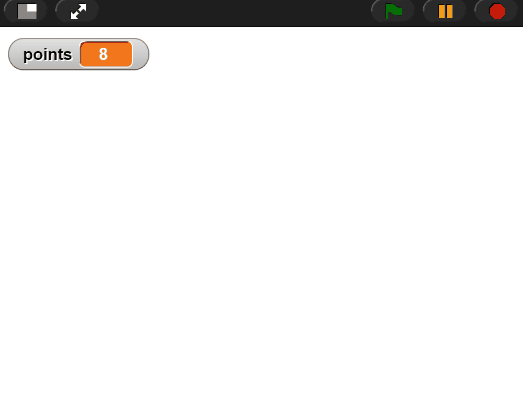
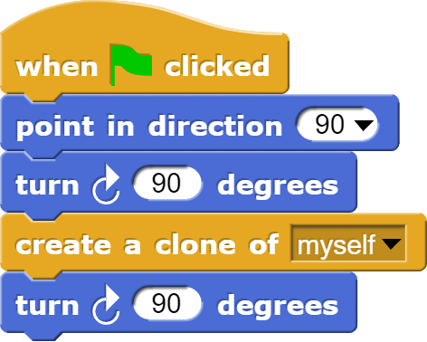
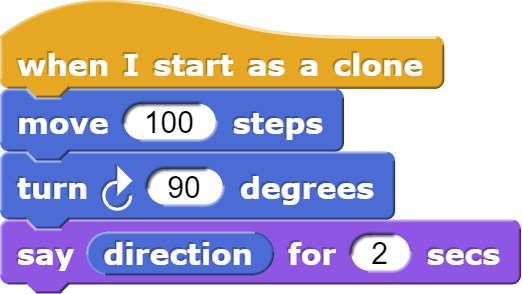

# Clones
  
  

<!--
Notes:
* Manually create Clones
* Slides: Parent properties, Removing clones, Clone blocks
* When I start, move down by 5 x 20
* Pause: You try
* Note clone counts
* Delete clone at end, change to x100
* Create an array of clones: start at -200,150; change x by 40
* Make a game:
  * Hide: Note it keeps its parent's hiddenness
  * Random delay: Randomness is a good way to differentiate clones
* Modify
* Knowledge check

-->

---
## Clones keep their parent's properties

When a clone is created, it inherits the original Sprite's:

* Position
* Rotation
* Size
* And other properties of the sprite

However, after creation, changing one's properties doesn't affect the other.

---
## Removing Clones
Clones go away when the Green Flag or Stop buttons are pressed.

---
## Clone blocks

These are the primary blocks used with variables

*    **Creates** a clone of the current sprite (or clone).
*    **Runs** code below it when a clone is created.
*    **Deletes** the current clone.

---
<!-- .slide: id="modify" -->
## Modify: Add Points

**Goal**: Create a new variable, `points`, that starts at 0 and goes up
by 1 each time the mouse cursor touches a clone, and then delete the clone.

[Hints](#/modify-hint)

v---v
<!-- .slide: id="modify-hint" -->
## Hints

* Remember the variable recipe (create, initialize, modify).
* Use the "when I am mouse-entered" block.

[Back](#/modify)

---
<!-- .slide: id="q1" -->
## Knowledge Check: Clones
What will the clone say after the green flag is clicked? Note that turning clockwise *increases* the direction.

[A) 90](#/a)

[B) 180](#/b)

[C) 270](#/c)

[D) 360](#/d)

v---v
<!-- .slide: id="a" -->
## A

Incorrect: Remember, clone inherits its parent's initial rotation, then modifies it.

[Try again?](#/q1)

v---v
<!-- .slide: id="b" -->
## B

Incorrect: Remember, clone inherits its parent's initial rotation, then modifies it.

[Try again?](#/q1)

v---v
<!-- .slide: id="c" data-background-color="#3333aa" -->
## C

Correct!

<button class="navigate-right btn btn-success">Continue</button>

v---v
<!-- .slide: id="d" -->
## D
Incorrect: Remember, changes to the parent's rotation after the clone is created don't affect the clone's rotation.

[Try again?](#/q1)

---
<!-- .slide: id="q1-finished" data-state="q-finished" -->
## Good job!

