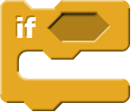
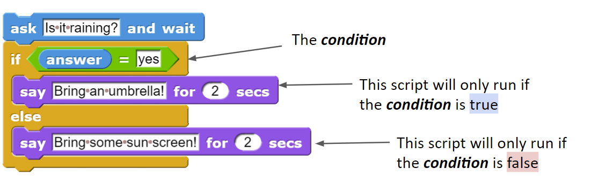
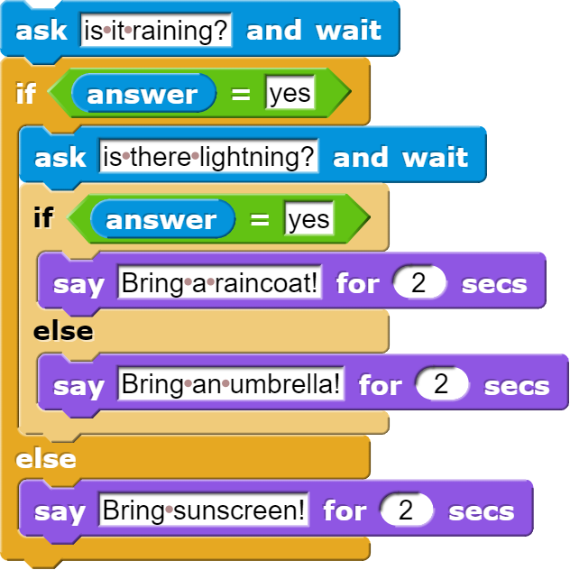
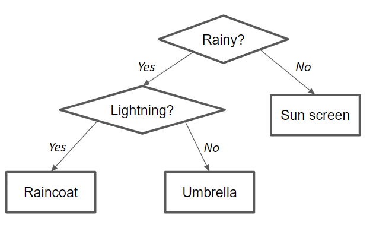
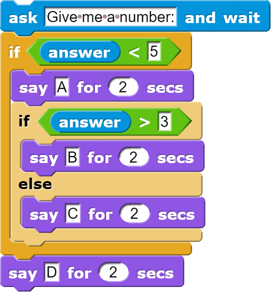

# Conditionals

<!--
Notes:
- If rainy: bring umbrealla
- Else: wear sunscreen
- Slide: If else
- All code is run: Ask a follow-up: is there lightning? if so bring raincoat
- MCQ: Ifs
- Demonstrate: Drawing
- Demonstrate: Colors
- Modify: Flag of Benin
-->

---
## Reminder: Predicate Blocks

Hexagon-shaped blocks that always report either **true** or **false**.

**Example**: *This code will report **true** if the user's `answer` is "rainy", and otherwise **false***

---
## The If/Else Block
The if/else block will run either the first script inside (if the condition is true), or the second script if not.

---
## Combining Ifs
When you combine multiple if/else blocks, it can be helpful to think of it
as a *flowchart* that decides the computer's behavior.

Some decisions are "nested" within others and go more inside the code

---
<!-- .slide: id="q-input" -->
## Knowledge Check: If
What input will cause this code to say "A, B, D"

[A) 2](#/a)

[B) 3](#/b)

[C) 4](#/c)

[D) 5](#/d)

v---v
<!-- .slide: id="a" -->
## A

Incorrect: Will the inner condition be true or false when `answer` = 2? To say "B" it must be true.

[Try again?](#/q-input)

v---v
<!-- .slide: id="b" -->
## B

Incorrect: Will the inner condition be true or false when `answer` = 3? To say "B" it must be true.

[Try again?](#/q-input)

v---v
<!-- .slide: id="c"  data-background-color="#3333aa" -->
## C

Correct!

<button class="navigate-right btn btn-success">Continue</button>

v---v
<!-- .slide: id="d" -->
## D

Incorrect: Will the outer condition be true or false when `answer` = 5? To say "A" and "B" it must be true.

[Try again?](#/q-input)

---
<!-- .slide: id="q-input-finished" data-state="q-finished" -->
## Good job!

---
<!-- .slide: id="modify" -->
## Modify: Flag of Benin

**Goal**: Modify the current code so that the colors match the flag of Benin.

[Hints](#/modify-hint)

v---v
<!-- .slide: id="modify-hint" -->
## Hints

* You will need to if/else blocks for this, one inside another.
* Make a flowchart: which decision comes first: the x-position or the y-position?

[Back](#/modify)
