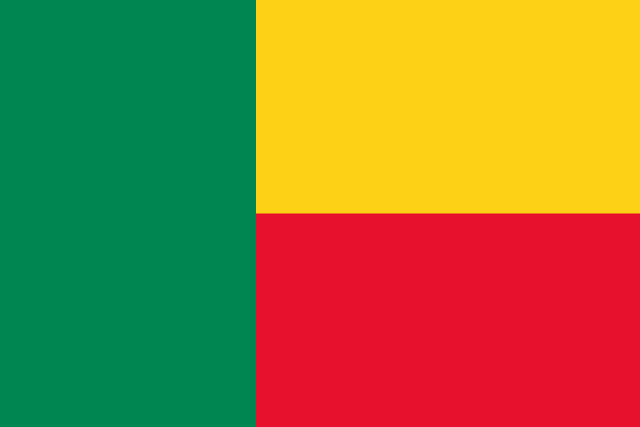
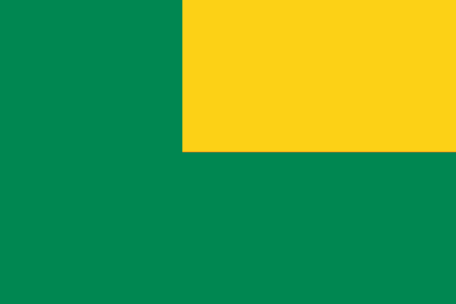
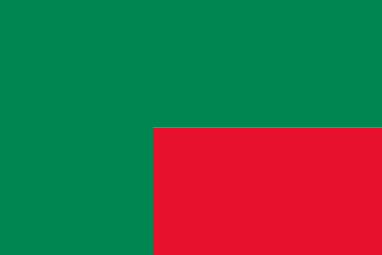
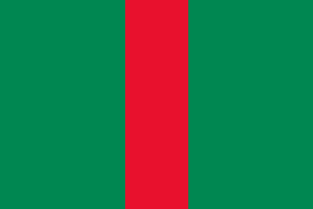

# Logic

<!--
Notes:
- Demonstrate: Drawing: If in Loop
- Modify: Flag of Benin (Demonstrate: Half a flag)
  * Note: Use > blocks
- Demonstrate: Yellow-Corner
- Logic blocks: and
- Demonstrate: Yellow-Corner with and
- Loic blocks: not
- Demonstrate: Red corner with and not
- Logic blocks: or
  * Note: Not the or we normally think of
- Demonstrate: Green stripes
-->

---
<!-- .slide: id="modify" -->
## Modify: Flag of Benin

**Goal**: Modify the current code so that the colors match the flag of Benin.

[Hints](#/modify-hint)

v---v
<!-- .slide: id="modify-hint" -->
## Hints

* You will need to if/else blocks for this, one inside another.
* Make a flowchart: which decision comes first: the x-position or the y-position?

[Back](#/modify)

---
## Yellow Corner

---
## Red Corner

---
## Green Stripes

---
## Logic Blocks

*    Reports true only if **both** of its inputs are true.
*    Reports true if **either** of its inputs are true.
*    Reports the **opposite** of its input.