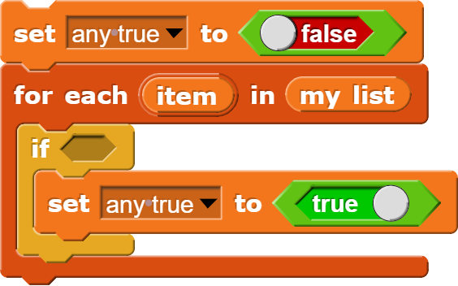
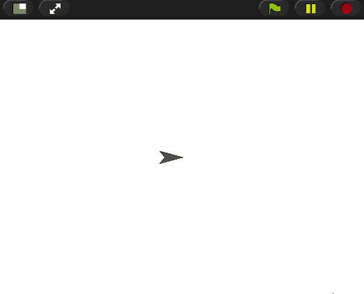
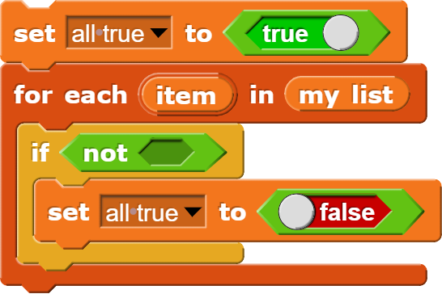

# Lists: Any/All

<!--
Notes:
Slide: Any, Recipe
Demonstrate: Any greater than 5
Demonstrate: Getting user input
Slide: All
Modify: All

-->
---
## Any

We often want to ask if something is true of **any** item in a list:
* In an app: Are **any** of the items on sale?
* In a game: Are there **any** coins left on the screen?
* Are **any** of the numbers [2, 4, 7] odd? (true)

The input is a list, and the output is a true/false (boolean) value.

---
## Recipe: Any

A recipe for telling if *any* item meets a condition:

---
## All

We also often want to ask if something is true of **all** items in a list:
* In an app: Has the user entered **all** the request data?
* In a game: Are **all** the enemies defeated?
* Are all of the numbers [2, 4, 7] less than 10? (true)

---
## Recipe: All

Can you figure out the recipe for all?

* With any, the variable was `false` until we see an item that meets the condition. Then we set it to `true`.
* With all, that variable is `true` until we see an item that does `not` meet the condition. Then we set it to `false`

---
<!-- .slide: id="modify" -->
## Modify: Contains Check

**Goal**: Modify the code so that it checks if **all** words start with "a".

[Hints](#/modify-hint)

v---v
<!-- .slide: id="modify-hint" -->
## Hints

Here's a generic recipe for all:

[Back](#/modify)

