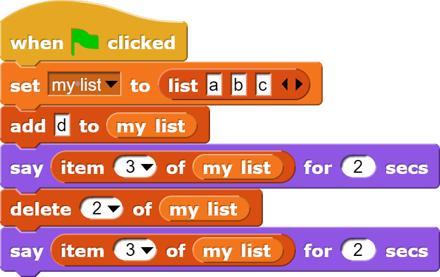

# Lists
<!--
Notes:

-->
---
## List Indexes
Each item in the list has an **index**, starting at 1.

* The item at **index 2** is **b**.
* The **index of a** in the list is 1.

---
## Indexes Change

If I insert "Kiwi" at index 2...

1. Apple
2. Banana
3. Cherry

---
## Indexes Change

... Banana and Cherry shift down, and their index increases (to 3 / 4).

1. Apple
2. Kiwi
3. Banana
4. Cherry

---
## Indexes Change

If I delete "Banana" at index 3...

1. Apple
2. Kiwi
3. Banana
4. Cherry

---
## Indexes Change

... Cherry will shift up, and its index goes down (to 3).

1. Apple
2. Kiwi
3. Cherry

---
## List Blocks: Reporters

To read information about lists, we use these **reporter** blocks:

*    **Creates** a new list with the given items: [a, b, c].
*    Gets the **list item** at the given index: a.
*    Gets the **length** of the given list: 3.

---
## List Blocks: Commands

To read information about lists, we use these **reporter** blocks:

*    **Sets** `my list` to the list [a, b, c].
*    **Adds** a new item to the end of the list: [a, b, c, d].
*    **Deletes** the item in the list at the given index: [a, c, d].
*    **Inserts** the item in the list at the given index, pushing other items to the right: [x, a, c, d].

---
<!-- .slide: id="average" -->
## Modify: Average

**Goal**: Create a new variable, `count`, that counts the number of times
the user has entered a number. Then, after the user has said 'stop',
say the average of all the numbers.

Example: If the user says `4`, `2`, `5`, `3`, `stop` the sprite should say:

> Average: 3.5

[Hints](#/average-hint)

v---v
<!-- .slide: id="average-hint" -->
## Hints

Follow the variable + loop recipe:

1. **Create** the variable and give it a descriptive name: "count"
2. **Initialize** the variable to a starting value **before the loop**: 0
3. **Change** the variable value when appropriate **inside the loop**: add 1
4. **Use** the variable value in your code, **after** the loop: say the average (sum / count)

[Back](#/average)

---
<!-- .slide: id="q1" -->
## Knowledge Check: Variable + Loop
What will the sprite say after this code is run?

[A) 2, 6](#/a)

[B) 2, 15](#/b)

[C) 5, 0](#/c)

[D) 2, 9](#/d)

v---v
<!-- .slide: id="a" -->
## A

Incorrect: Remember, `total` changes by the *current* value of value, which is different each time the loop runs.

[Try again?](#/q1)

v---v
<!-- .slide: id="b" -->
## B

Incorrect: Remember, `total` changes by the *current* value of value, which is different each time the loop runs.

[Try again?](#/q1)

v---v
<!-- .slide: id="c" -->
## C

Incorrect: Remember, the variables change values in the loop before being said.

[Try again?](#/q1)

v---v
<!-- .slide: id="d" data-background-color="#3333aa" -->
## D

Correct!

<button class="navigate-right btn btn-success">Continue</button>

---
<!-- .slide: id="q1-finished" data-state="q-finished" -->
## Good job!

| Repeat | `value` | `total` |
| ------ | ------- | ------- |
| before | 5       | 0       |
| 1      | 4       | 4       |
| 2      | 3       | 7       |
| 3      | 2       | 9       |
| after  | 2       | 9       |

