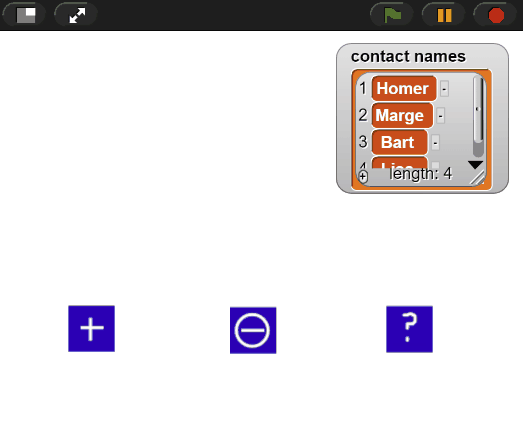

# Lists

<!--
Notes:
Demonstrate: Create list
* Show different types in list
Slides: Indexes
Demonstrate: item, length, contains
Slides: Reporters
Demonstrate: set, add, delete, insert
Slide: Commands
Quiz
Demonstrate: Add
Modify: Add only if not contains
Demonstrate: Remove

-->
---
## List Indexes
Each item in the list has an **index**, starting at 1.

| 1 | 2 | 3 |

* The item at **index 2** is **b**.
* The **index of a** in the list is 1.

---
## Indexes Change

If I insert "Kiwi" at index 2...

1. Apple
2. Banana
3. Cherry

---
## Indexes Change

... Banana and Cherry shift down, and their index increases (to 3 / 4).

1. Apple
2. Kiwi
3. Banana
4. Cherry

---
## Indexes Change

If I delete "Banana" at index 3...

1. Apple
2. Kiwi
3. Banana
4. Cherry

---
## Indexes Change

... Cherry will shift up, and its index goes down (to 3).

1. Apple
2. Kiwi
3. Cherry

---
## List Blocks: Reporters

To read information about lists, we use these **reporter** blocks:

*    **Creates** a new list with the given items: [a, b, c].
*    Gets the **list item** at the given index: a.
*    Gets the **length** of the given list: 3.
*    Reports true if the list includes the given element at least once: false.

---
## List Blocks: Commands

To read information about lists, we use these **reporter** blocks:

*    **Sets** `my list` to the list [a, b, c].
*    **Adds** a new item to the end of the list: [a, b, c, d].
*    **Deletes** the item in the list at the given index: [a, c, d].
*    **Inserts** the item in the list at the given index, pushing other items to the right: [x, a, c, d].

---
<!-- .slide: id="q1" -->
## Knowledge Check: Lists
What will the sprite say after this code is run?

[A) b, c](#/a)

[B) c, d](#/b)

[C) c, c](#/c)

[D) d, [nothing]](#/d)

v---v
<!-- .slide: id="a" -->
## A

Incorrect: Remember, items are added to the *end* of a list.

[Try again?](#/q1)

v---v
<!-- .slide: id="b" data-background-color="#3333aa" -->
## B

Correct: c is the third item in the list until b is deleted; then it's d.

<button class="navigate-right btn btn-success">Continue</button>

v---v
<!-- .slide: id="c" -->
## C

Incorrect: Remember, when an item (e.g. #2) is deleted, all items after it (e.g. c) shift to the left, and their index changes.

[Try again?](#/q1)

v---v
<!-- .slide: id="d" -->
## D

Incorrect: Remember that in Snap, indexes start at 1, so the third item to start with is c, not d.

[Try again?](#/q1)

---
<!-- .slide: id="q1-finished" data-state="q-finished" -->
## Good job!

---
<!-- .slide: id="modify" -->
## Modify: Contains Check

**Goal**: Modify the code for adding a new contact so it checks whether a
contact **already exists**, and if so warns the user and *does not* add the contact.

[Hints](#/modify-hint)

v---v
<!-- .slide: id="modify-hint" -->
## Hints

* You will need the `__ contains __` block, under the variables category.
* You will also need an `if / else` block.
* Remember, the contact should only be added if it is not already contained in the contact list.

[Back](#/modify)

