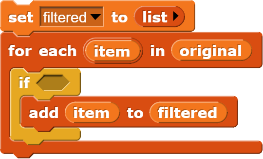
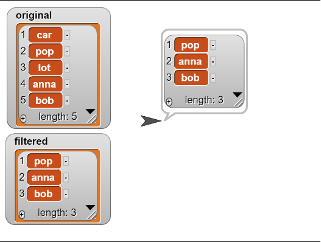

# Lists: Filtering

<!--
Notes:
Demonstrate: For each block
Slides: filter, code
Demonstrate: Filter:
* Less than
* Odd
* Start with A
Modify

-->
---
## Filtering

We often want to filter out a list to keep only items that match a given condition. For example:
* Filter `[-2, 3, 2, -5]` to keep only **positive numbers**: `[3, 5]`
* Filter `["apple", "banana", "cherry"]` to keep only words containing "e": `["apple", "cherry"]`
* Filter `[1, 2, 3, 4]` to keep only items in the list `[5, 3, 1]`: `[1, 3]`

The *items* and their *order* remain unchanged, but the list may get smaller.

---
## Recipe: Filter

A recipe for filtering a list `original` based on a condition:

1. Create a new, empty list `filtered` to hold the filtered items.
2. Iterate over each `item` in `original`:
3. `If` the item matches the condition, add it to `filtered`

After iteration, `filtered` will be the filtered list.

---
## Recipe: Filter

---
<!-- .slide: id="modify" -->
## Modify: Contains Check

**Goal**: Modify the filter code so that it keeps only words that start and end
with the same letter.

**Note!**: To test, you will need to modify the `original` list to   [car, pop, lot, anna, pop].

[Hints](#/modify-hint)

v---v
<!-- .slide: id="modify-hint" -->
## Hints

* You will need two of the `letter __ of word __` block.
* You only need to modify the filter condition.

[Back](#/modify)

