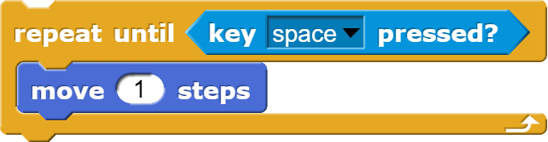
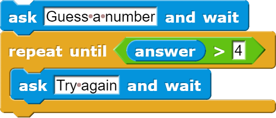

# The Repeat Until Block

<!--
Notes:
- Move forward until sprite hits edge (can't do with repeat)
- Repeat until slide
- Fix code to work w/ repeat until, randomness
- Predicates: before right side
- Modify: Sprite points down instead
- Predicates
- Modify task to go down
- Explain repeat user input
- Quiz
-->

---
## The Repeat Until Block

The `repeat until ___` block repeats all actions inside of it, in order, **until** its condition is met.

**Example**: *This code will move the Sprite forward **until** the space key is pressed.*

---
## Predicate Blocks

Hexagon-shaped blocks that always report either **true** or **false**.

**Example**: *This code will report **true** if the user's `answer` is "Yes", and otherwise **false***

---
<!-- .slide: id="goDown" -->
## Modify: Move Downwards

**Goal**: Modify the current code so that the Sprite stops moving when it's *y-position* is less than -150:

 <!-- .element style="width: 40%" -->

[Hints](#/goDown-hint)

v---v
<!-- .slide: id="goDown-hint" -->
## Hints

* Remember, as the sprite moves downward, y *decreases*.
* There is also a  block under the Motion category.
* You may need the  (less than) predicate block.

[Back](#/goDown)

---
<!-- .slide: id="q-input" -->
## Knowledge Check: Repeat
What input will cause this code to ask "Try again" exactly 3 times.

[A) 1 2 3 4](#/a)

[B) 2 3 4 5](#/b)

[C) 7 6 5 4](#/c)

[D) 6 5 4 3](#/d)

v---v
<!-- .slide: id="a" -->
## A

Incorrect: Remember, the `repeat until` block uses a greater than (`>`) condition, and none of the inputs are greater than 4.

[Try again?](#/q-input)

v---v
<!-- .slide: id="b" data-background-color="#3333aa" -->
## B

Correct: When the input 5 is given, 5 > 4, so the loop will stop after saying "Try again" 3 times.

<button class="navigate-right btn btn-success">Continue</button>

v---v
<!-- .slide: id="c" -->
## C

Incorrect: Remember, the `repeat until` loop runs *until* the condition is true (not as long as it's true), which would happen after just 1 input.

[Try again?](#/q-input)

v---v
<!-- .slide: id="d" -->
## D

Incorrect: Remember, the `repeat until` loop runs *until* the condition is true (not as long as it's true), which would happen after just 1 input.

[Try again?](#/q-input)

---
<!-- .slide: id="q-input-finished" data-state="q-finished" -->
## Good job!