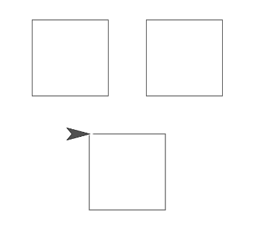
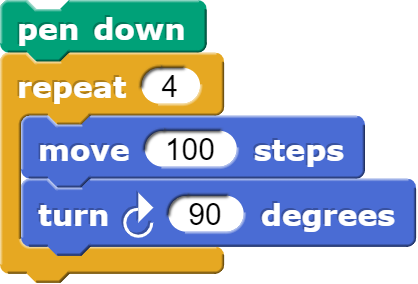
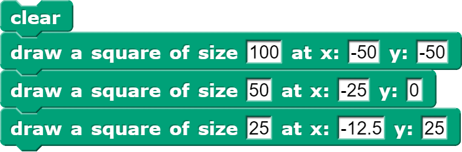
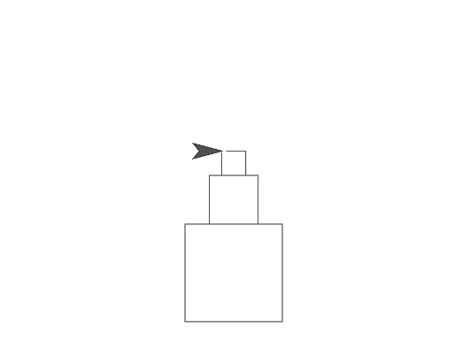
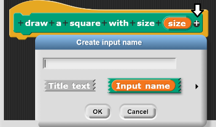
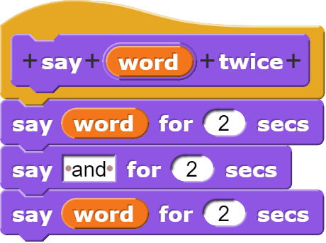
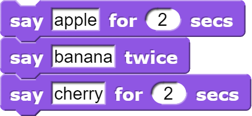

# Procedures

<!--
Notes:
Draw a square
Slides: Motivation & Procedures
Show how to draw a square with a procedure
Draw at (-125,-125), (25, -125) and (-50, 25)
Slide: Why use procedures?
Add an input for size
Modify: Tower + Solution
Emphasize  that the code is run in the procedure when it gets there
MCQ
-->

---
## Motivation

I know how to draw a square, but what if I wanted to draw 3 squares...

---
## Procedures

**Procedure**: In programming, a procedure is a name that we give to a series of commands that can be reused multiple times.

For example, let's give the code below a name: "draw a square"

---
## Why use procedures?
Procedures are useful when we want to:
* Save time by using the same code in multiple places.
* Make our code easy to read for ourselves and others.
* Use the same code to do different variations on the same task:
   * E.g. drawing a square of size 100, size 50, size 25

---
<!-- .slide: id="tower" -->
## Modify: Make a Tower

**Goal**: Modify the block so it takes an x and y coordinate for the square:

[Hints](#/tower-hint)

v---v
<!-- .slide: id="tower-hint" -->
## Hints

* Remember you should right-click on your block and select "edit" from the menu.
* You can add an input by pressing the [+] button: 
* Once you create an input (e.g. the x-coordinate square), you can use it in your code.
* The `go to X __ Y __` block will be useful.

[Back](#/tower)

---
<!-- .slide: id="q1" -->
## Knowledge Check: Custom blocks
Given the definition of `say ___ twice` below, what will the following code say when it runs?

[A) Apple Banana Cherry](#/a)

[B) Apple Banana Banana Cherry](#/b)

[C) Apple Banana and Banana Cherry](#/c)

[D) Banana and Banana Apple Cherry](#/d)

[E) Apple Cherry](#/e)

v---v
<!-- .slide: id="a" -->
## A

Incorrect: Remember, when we use our `say ___ twice` block, it runs the code inside that block,
which is different from the `say` block.

[Try again?](#/q1)

v---v
<!-- .slide: id="b" -->
## B

Incorrect: Look closer at exactly how the `say ___ twice` block is defined.
How many things are said?

[Try again?](#/q1)

v---v
<!-- .slide: id="c" data-background-color="#3333aa" -->
## C

Correct! We run the code in order, and move to the code in the `say ___ twice`
block when we get there.

<button class="navigate-right btn btn-success">Continue</button>

v---v
<!-- .slide: id="d" -->
## D

Incorrect: Remember, we run the code in the order of the script, and move to the
code in the `say ___ twice` block when we get there.

[Try again?](#/q1)

v---v
<!-- .slide: id="e" -->
## E

Incorrect: Remember, when we use our `say ___ twice` block, it runs the code inside that block.

[Try again?](#/q1)

---
<!-- .slide: id="q1-finished" data-state="q-finished" -->
## Good job!