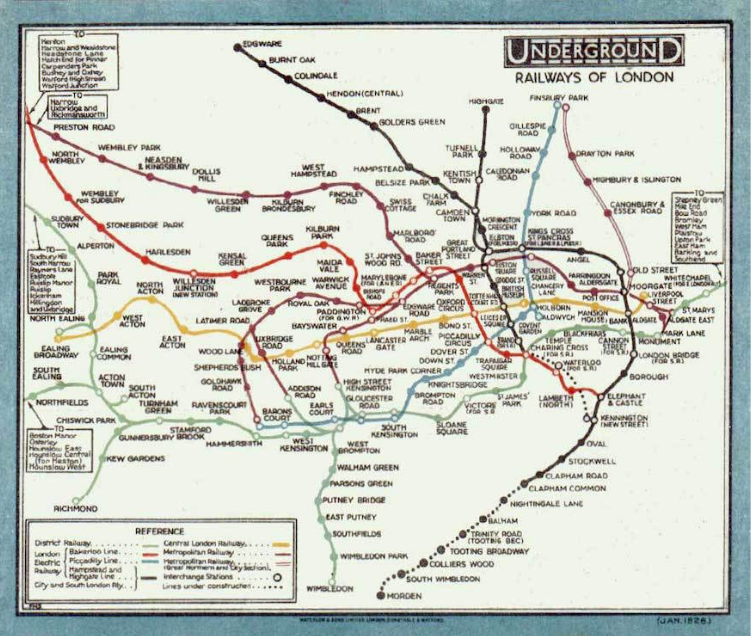
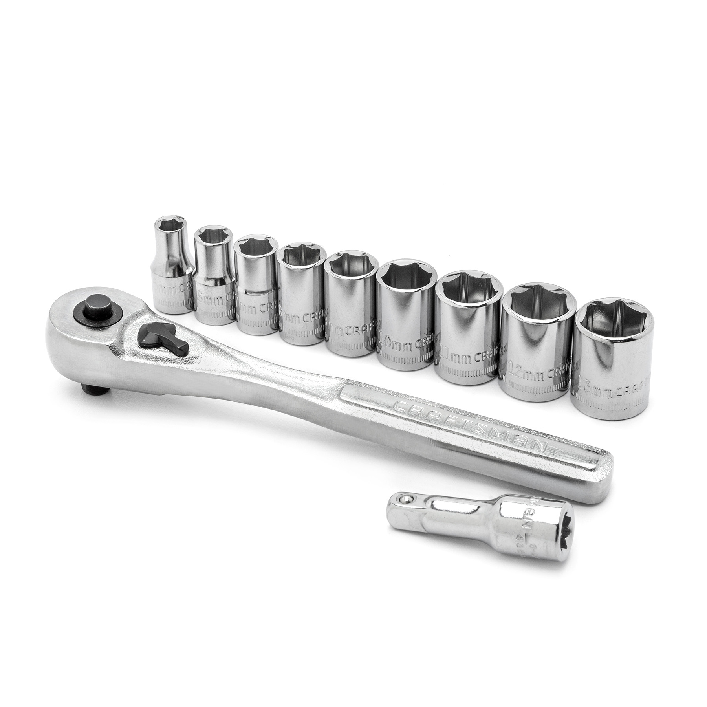

# Procedures: Use Cases

<!--
* Show code: ask the student to decide what it does and write it down.
* Slides: Motivation, Recipe
* Create "rainbow line of size %size" block
* Slides: Reading, Abstraction, Modify
* Modify: Hue + Solution
* Slides: Decomposition
* Modify: Rainbow triangle
* Reflect: How much easier was that now that we have the rainbow block
-->

---
## Motivation

Reasons to use procedures:

1. Makes code easier to read.
2. **Abstraction**: separate "what code does" and the "how it does it".
3. Makes code easier to modify.
4. **Decomposition**: Helps us break code down into

---
## Recipe: Replace Code with a Procedure

1. **Identify**: Identify where multiple chunks of code do a similar *thing*. This is the name of the procedure.
2. **Similarities**: The code that is the *same* goes in the procedure.
3. **Differences**: The parts that are *different* correspond to inputs.

---
## 1. Reading

Which is easier to understand?

The implementation

...or the block's name?

---
## 2. Abstraction

Idea: We want to separate *what code does* (e.g. draw a rainbow line) from *how it does it* (i.e. `set pen hue`, `pen down`, ...). We accomplish abstraction in two ways:

1. **Remove unimportant details** so we can focus on important things.
  We replaced complex code with a single "rainbow line" custom block.
2. **Generalize** similar ideas into a single category.
  Each piece of code drew a "rainbow line", but the lenght input differed.

---
## 2. Abstraction: Detail Removal

1926 London Underground Map

1933 London Underground Map

---
## 2. Abstraction: Generalization

Instead of building 7 different socket wrenches...

Build one and make it adjustable!

---
## 3. Modifying

When code is in a procedure, it is easier to modify your program's behavior because the code is all in one place.

---
<!-- .slide: id="modify" -->
## Modify: Hue Change

**Goal**: Modify the `rainbow line` block so that the lines start at hue 30 (green) and change hue twice as fast (by 10).

[Hints](#/modify-hint)

v---v
<!-- .slide: id="modify-hint" -->
## Hints

* You will need to edit the custom block to make these changes.
* You will need to edit the `set pen hue` and `change pen hue` blocks.

[Back](#/modify)

---
## 4. Decomposition

* When we break *big problems* down into *small tasks*, they are easier to solve.
* Procedures help us define those "small tasks".
* One we've solved the small problem (e.g. how to draw a rainbow line), it's easier to solve more complex problems (e.g. how to draw a rainbow shape).

---
<!-- .slide: id="modify2" -->
## Modify: Hue Change

**Goal**: Use `rainbow line` block to draw a rainbow triangle, where each side is 200 steps long.

[Hints](#/modify2-hint)

v---v
<!-- .slide: id="modify2-hint" -->
## Hints

* You already know how to draw a traingle using the `move` and `turn` blocks.
* Use the `rainbow line` block instead of `move`.
* Since the `rainbow line` block already puts the pen down, you shouldn't need the `pen down` block.

[Back](#/modify2)