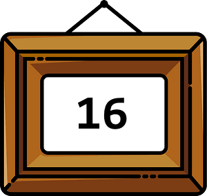

# Snap's Variables

<!--
Notes:
* Slides: Variables & Buckets
* x and y position:
    * reading
    * watchers
    * setting
    * coordinates
    * changing
    * Pause: put the spirte in the top-left corner of the screen
* direction
* read-only vars: x, y mouse position
* Quiz: What will the x-corrdinate be?
-->

---
## Variables

Variables allow the computer to remember a **value** like:

* How many sides should the shape have?
* What is the player's name?
* What are the (x, y) coordinates of the button on the screen?

---
## Variables: Read & Store

A variable is like a picture frame that stores a **value**:

* You can **read** the current value in the frame (e.g. 5).
* You can **store** new value in the frame (e.g. 16).
  * Variables only remember the **most recent** value you put there.

---
<!-- .slide: id="q1" -->
## Knowledge Check: Variables
What will the sprite say after this code is run?

[A) 25, 25, 25](#/a)

[B) 100, 50, -25](#/b)

[C) 100, 50, 25](#/c)

[D) 100, 100, 100](#/d)

v---v
<!-- .slide: id="a" -->
## A

Incorrect: Remember, reading a variable gets its *current* value, which changes each time you use `set` or `change`.

[Try again?](#/q1)

v---v
<!-- .slide: id="b" -->
## B

Incorrect: Remember, the `change` block is different than the `set` block. It adds or subtracts from the current value.

[Try again?](#/q1)

v---v
<!-- .slide: id="c" data-background-color="#3333aa" -->
## C

Correct!

<button class="navigate-right btn btn-success">Continue</button>

v---v
<!-- .slide: id="d" -->
## D

Incorrect: Remember, reading a variable gets its *current* value, which changes each time you use `set` or `change`.

[Try again?](#/q1)

---
<!-- .slide: id="q1-finished" data-state="q-finished" -->
## Good job!

