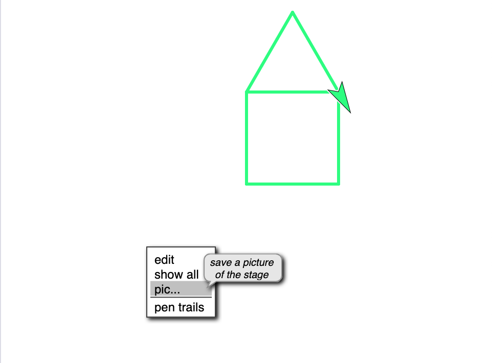
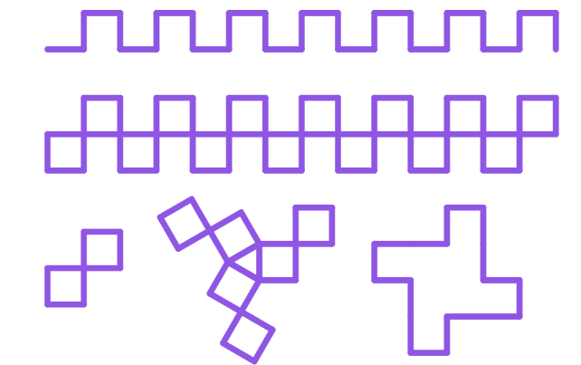
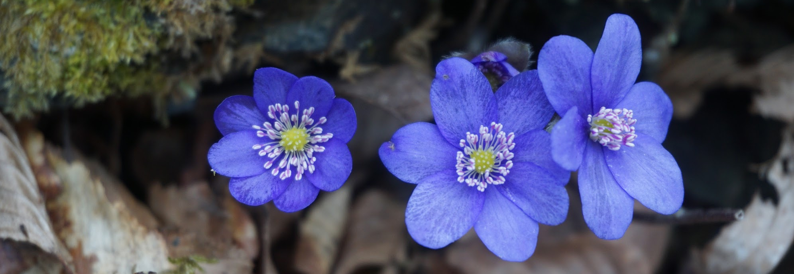
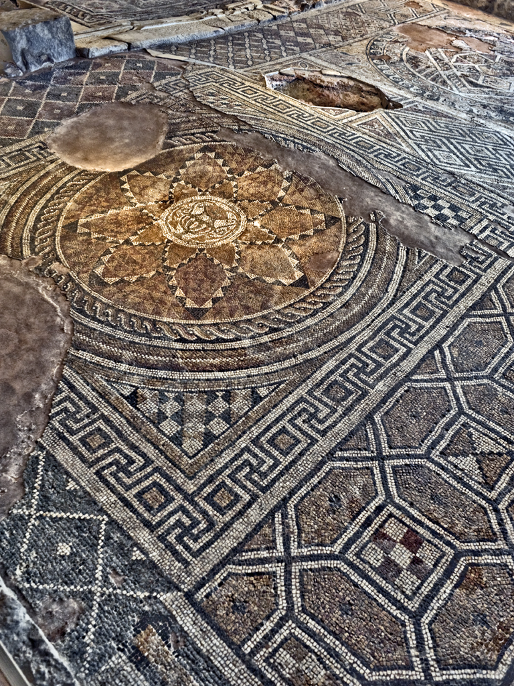
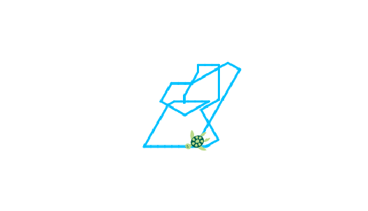

# Добре дошли

 Цветелин Андреев

---
## Цел на урока

* Да се запознаем с Костенурката.
* Да я накараме да рисува картини.

---
# Основни команди

---
# Демонстрация КЪЩА

---

---
## Задача 1

**Накарайте костенурката да рисува и други картини**

---
## Задача 2

**Нарисувайте първата буква от името си**

---
## Задача 3

**Нарисувайте дърво. Нарисувайте гора**

---
## Задача 4

**Нарисувайте цвете**

---
## Задача 5

**Изрисувайте следната фигура:**

**Използвайте я за да нарисувате:**

---
## Задача 6

**Накарайте костенурката да нарисува следната фигура:**

---
# Бъдете любознателни

---
## Задача 7

**Превърнете се в градинари и нарисувайте цветна градина с различни видове цветя. Например хризантеми, лилии, маргаритки.**

**По какво си приличат и различават?**

---
## Мозайки

---
## Задача 8

**Нарисувайте мозайка**

_Упътване:_

* _Посетете базиликите и културния център-музей Тракарт в Пловдив лично._
  * <a href="https://www.plovdivmosaics.org/" target="_blank">https://www.plovdivmosaics.org/</a>
  * <a href="http://trakart.org/" target="_blank">http://trakart.org/</a>

* _Изберете фрагменти от мозайката за вашата картина._

---
# От участниците

---

Небе и трева. Вяра (5 г.)

---
## Изпратете вашите най-красиви рисунки 

* Чрез чат бутона долу вдясно или
* Чрез електронна поща на <a href='mailto:cvetelin.andreev@gmail.com' target="_blank">cvetelin.andreev@gmail.com</a>

---
# Обобщение

* Припомнете си какво правихме в този урок.

* Нарисувайте това, което научихте или ви впечатли.

---
# Благодаря

---
## Бележки

<a href="https://www.youtube.com/watch?v=yzHedNhsqcU" target="_blank">Песен "Градинар на света"</a>

Идеята за задачата е взета от учебника ‘Информатика за начинаещи – част 1 – или с костенурката напред’, Евгения Сендова, Румен Николов, Издателство “Народна просвета”, 1989 г.

